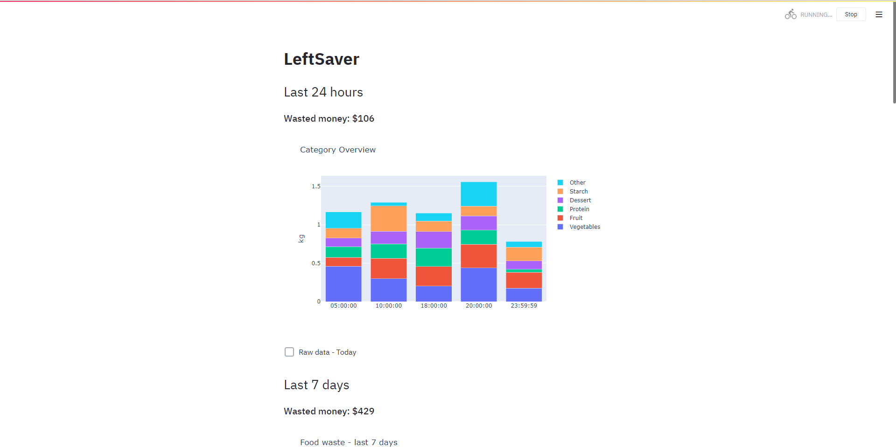
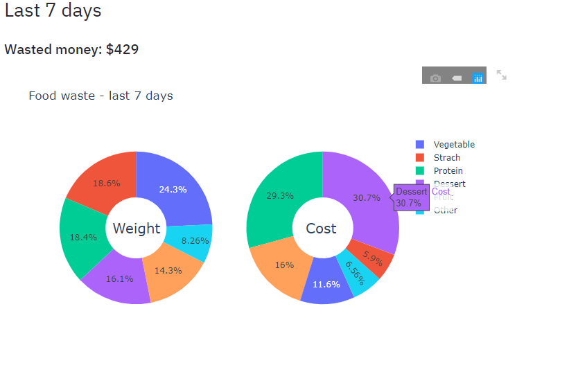
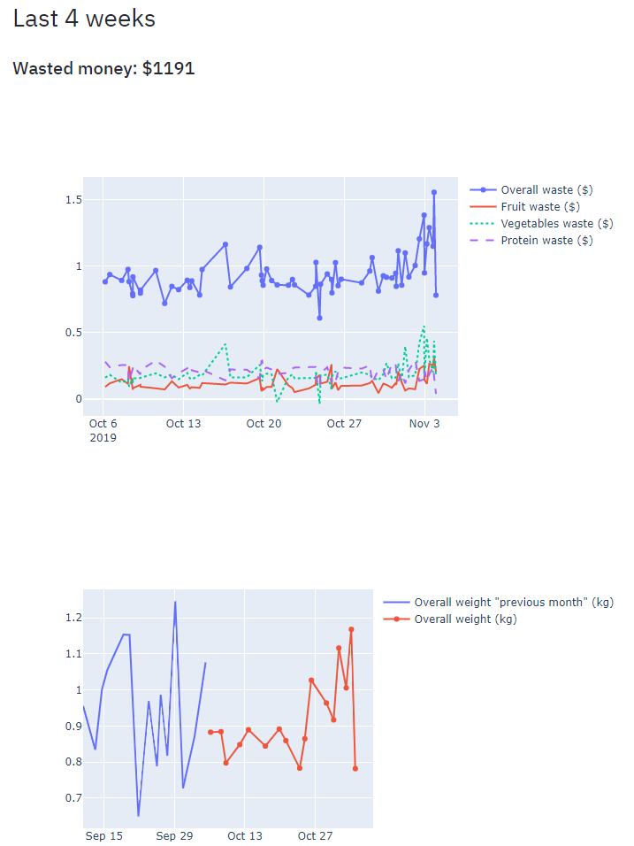

# LeftSaver
Leftsaver is a smart recycle bin that helps chefs to capture, track, and manage food waste to reduce food waste and increase their profit.

#### you can launch LeftSaver demo application by executing this command in your terminal:

`streamlit run app.py`

